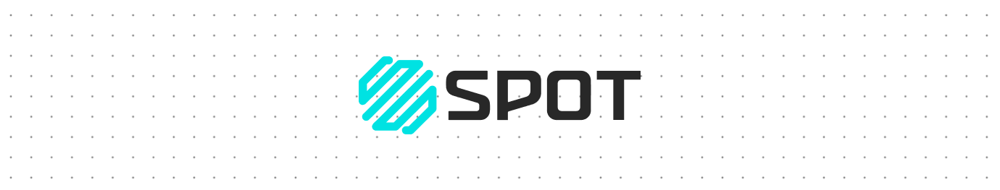

# Frontend Challenge

The challenge is to build a frontend Screen to showcase **Rick And Morty** characters, you are required to make pagination with no more than 10 items **per page**, present an image of the character(if present), name, species, number of episodes the character appears on the show and  current live status.

## What we expect the app to do

- User can see info about the characters(Name, Especie, Picture)
- User can search for a character in the main list
- User can create a list with up to 5 favorite characters
- Top 5 characters are shown on a custom frontend screen
- User can delete those characters from the list
- User can navigate between pagination

## Hey, that's not rocket science

We do know this will be easy for you... so, to level this up you can add your custom taste to this challange, you can add one, two or three of theese:
- Save user top 5 list in some way
- Make sharable links
- A responsive app to any screen size
- The sky is the limit, include more of your magic here

## What we expect from you

Dive into the way you solve problems, clean good code and we will be watching your git history : ).

We will receive your application with an URL, you can use Vercel, Netlify, Heroku or Github/Gitlab Pages to do so. 
You must send your application before `Saturday 12 at 1AM(UTC)`

## Resources 

- [The Rick and Morty API](https://rickandmortyapi.com/api/character)
- [React Documentation](https://reactjs.org/)
- [Fetch API](https://developer.mozilla.org/en-US/docs/Web/API/Fetch_API)
